<h1 align="center">The Pythonista</h1> 

  Pythonista is a social app designed for Python developers. Pythonista is a dynamic community platform for programmers to connect, share insights, and embark on collective coding journeys in a digital age where collaboration fuels innovation.
  Pythonista allows developers of all levels to easily connect to a global network of peers and a wealth of shared knowledge. Pythonista bridges the gap, fostering an ecosystem where the boundaries of code are transcended and the spirit of camaraderie reigns supreme. 

  <!-- deployed link -->
  <!-- I AM Responsive image -->

## Features

### _Existing Features_

 * **Navigation Bar**

    

    The navigation bar includes various clickable links, allowing the user to easily access the pages on the app. The links change according to whether the user is signed in or out, giving them access to more content once signed in.
    The links on the navbar are:

    * Pythonista Logo
    * Home
    * Create Post
    * Event
    * User Action (displayed as dropdown menu )
        * Profile
        * Sign Out
    * Sign Up
    * Sign In

   
    To make navigating easy for the user, the navigation bar is fixed, meaning it stays at the top of the page when the user scrolls down.

    The navigation bar displays in the same manner on all pages, ensuring uniformity across the app.

    A hover effect is incorporated, with the icons changing to a turquoise color and the cursor becoming a pointer on both the text and the icons, to help the user realize that the link is clickable.

    React Bootstrap was used to construct the navigation bar, which is fully responsive across devices.

* **Navbar When users are not loggedIn**

    

* **Navbar in Mobile's Screen**

    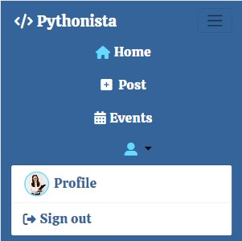

* **Navbar in Tablet's Screen**

    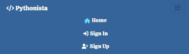

* **Home Page**

  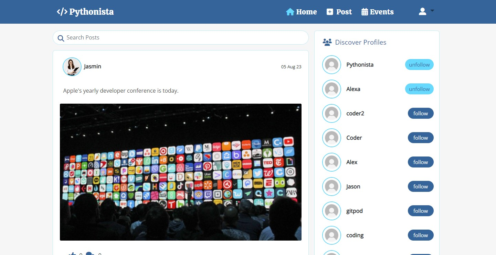

    The homepage is the user's first port of call and consists of user posts, post search, discover profiles.

    The posts show the user's username, and profile image, when it was posted, content as well as any user interaction in the form of likes and comments counts.

* **Post Page**

    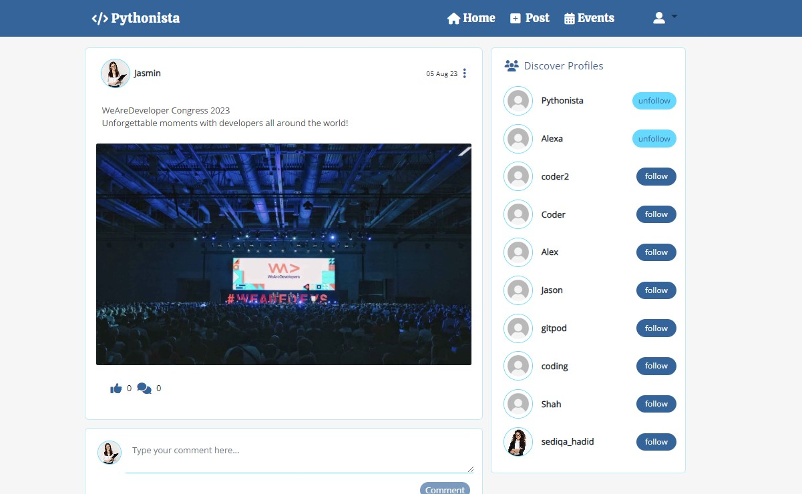

    The post page contains further information on the post in question, as well as the homepage version of the post.

    The features here are:

    * Ability to create a comment if logged in.
    * Ability to edit or delete post if you are the owner of the post.

* **Create Post Form**

    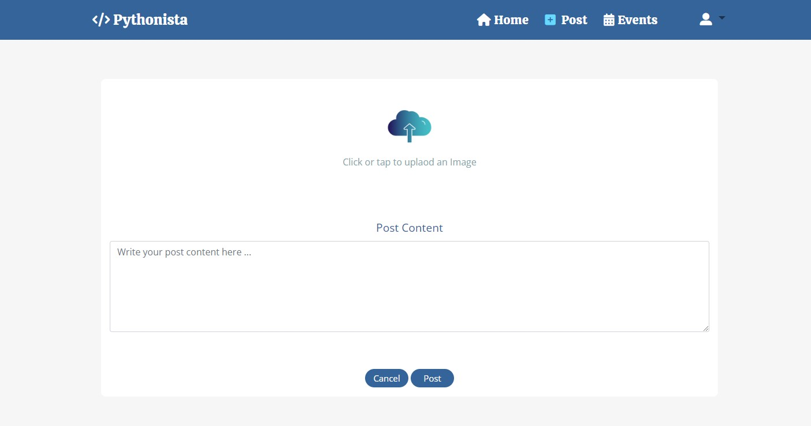

    If users are logged in, they are able to share new posts with the community. By clicking on the Create Post Icon in the Navigation Bar, they are taken to the Share a new post page, where they can submit the post creation form to the API.

* **Post Edit Form**

    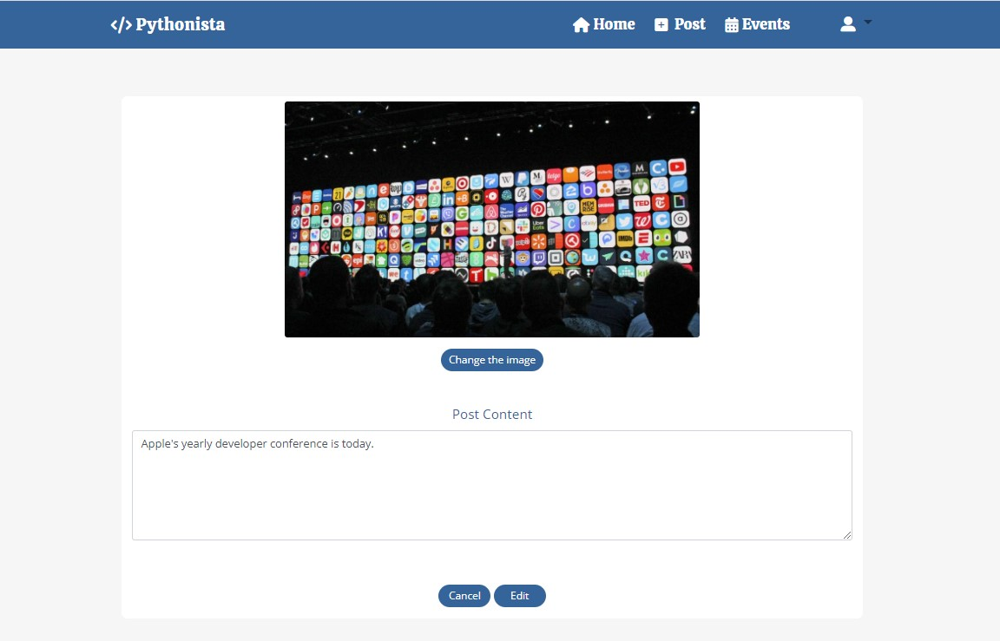

    If user click on a post it will take the user to the post page, by clicking the more button near post date , users can find the edit post feature there. By clicking edit users can see post creation form, but the fields are already pre-populated with the existing post information. You can edit the desired fields and save the changes, which will return you to the post detail page and you can see that the post has been updated successfully.

* **Events Page**

    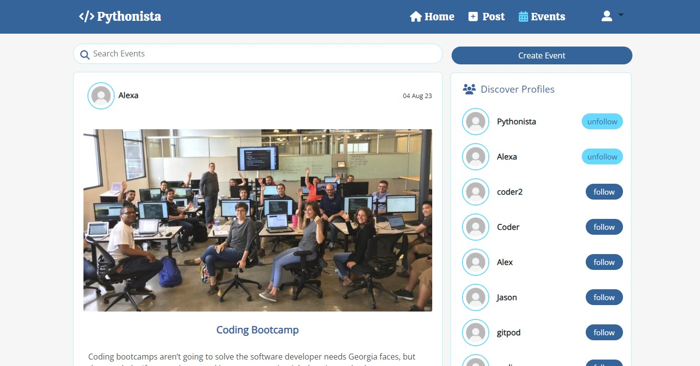

   The events page contains user-created events.

    The events display the user's username and profile image, as well as the day and time it was made, the title, content, and image generated, as well as event and organiser data, and any user participation in the form of attendance replies.

    The following functionalities are available:

    * A search bar that allows the user to quickly find existing events by username, title, and content.
    An Add Event button that allows the user to simply create their own event.
    * A Popular Profiles component that allows users to easily see other users on the app and follow and unfollow individuals as well as browse their profiles.

* **Event Page**

    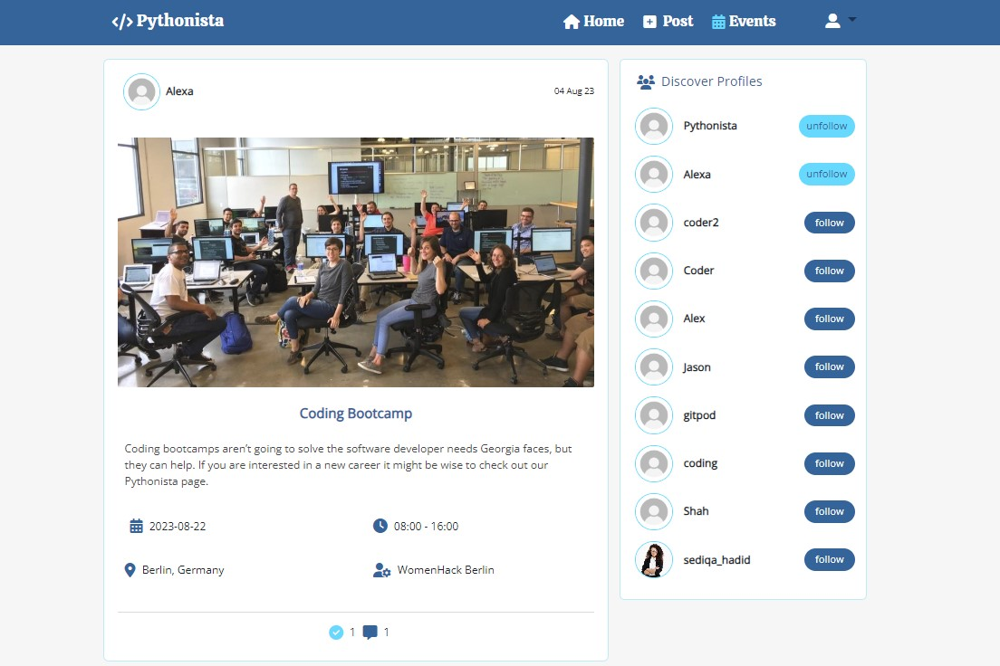

    The features here are:
    * Ability to edit or delete event if you are the owner of the event.

* **Create Event  Form**

    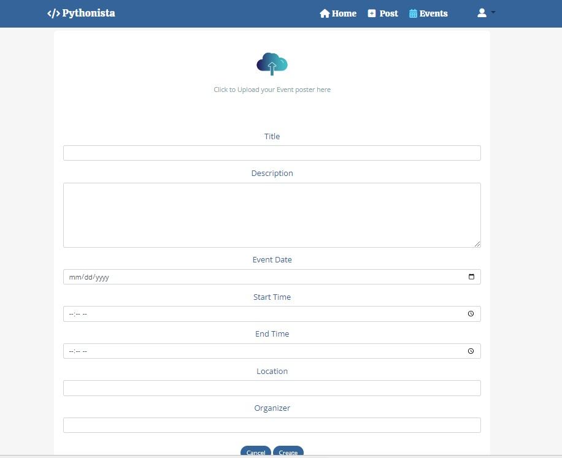

    If you are logged in, you are able to share new events with the community. By clicking on the Add Event menu option in the Navigation Bar, you are taken to the Share a New Event page, where you can submit the event creation form to the API.
    Create Event Form consist of event picture, title, description, event date, start time, end time, location and organizer.
    Once the form has been submitted successfully, you can see the event published successfully as you are re-directed automatically to the newly created event details page.

* **Edit Event Form**

    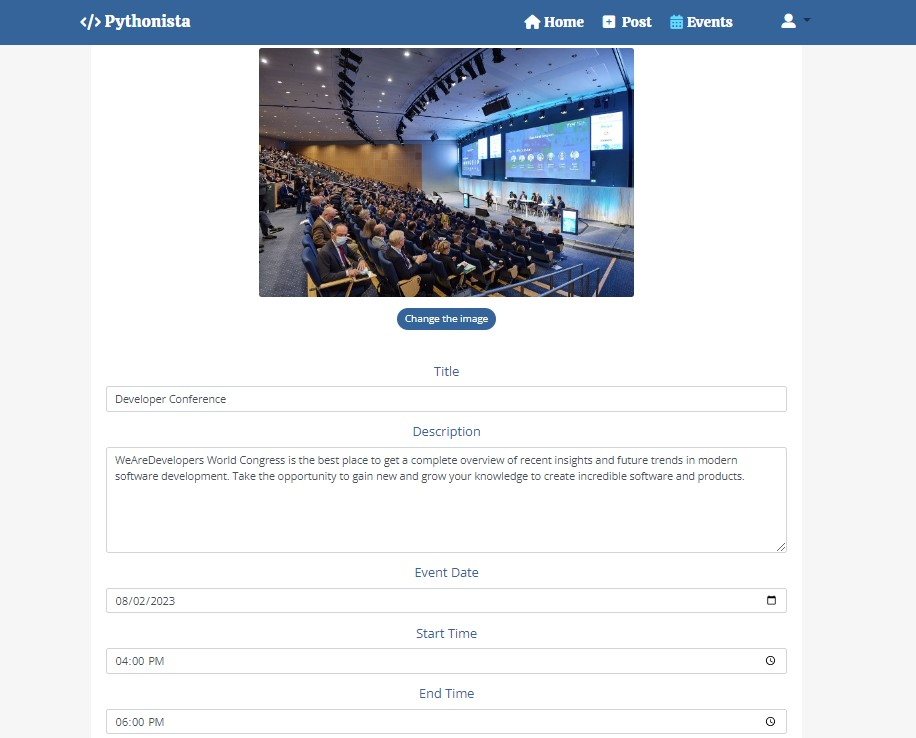

    By clicking Edit, you are taken back to the event creation form, but the fields are already pre-populated with the existing event information. You can edit the desired fields and save the changes, which will return you to the event detail page and you can see that the event has been updated successfully.

* **Validating Event Date**

   The Create Event Form is validated to determine that users are not able to add an event in the past; if users add an event date in the past, the form will raise an error that the event cannot be in the past. It will avoid entering the wrong date.

    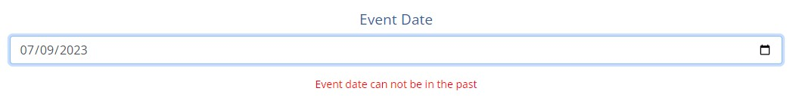

* **Profile Page**

    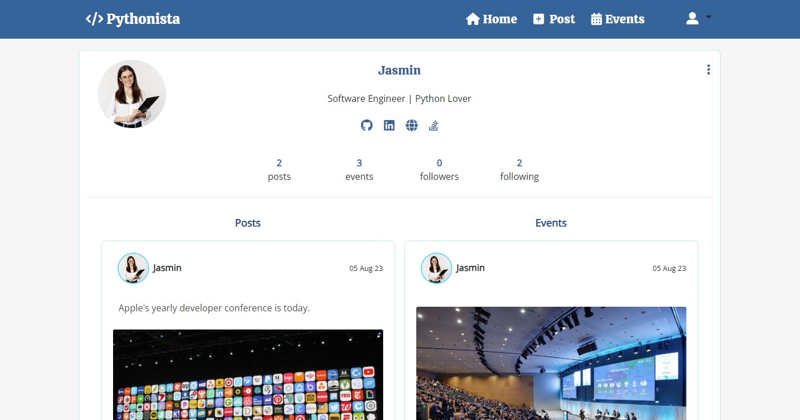

    The profile page consists conists of the selected user's profile - either your own via the navbar, or other users via clicking on their profile images.

    The profiles show the user's username, profile image, bio, any social media links included, user stats regarding followers, posts and events, as well as any posts or events created by the user.
    The only information that subsequently gets updated in the profile page is the site usage stats, as follows:

    * Number of events the user has posted
    * Number of posts the user has published
    * Number of profiles they are following
    * Number of profiles that are following them

* **Edit Profile Page**

    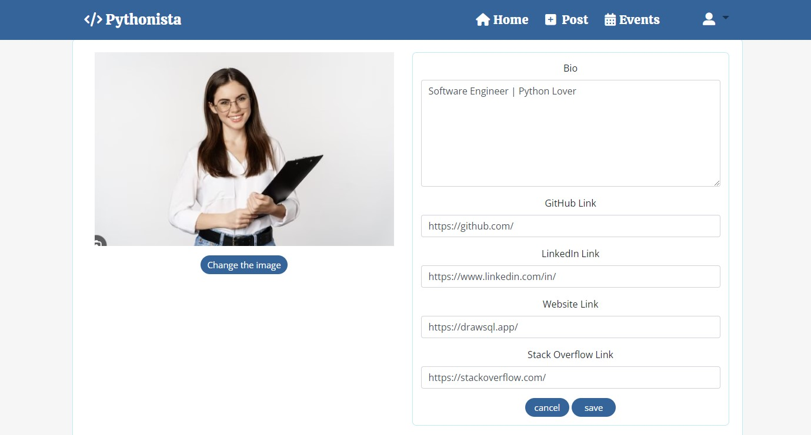

    By clicking the Edit Profile option, they are taken to a new page containing the full profile details form to fill in and submit. Here, they can add their own avatar image, bio, GitHub, website address and LinkedIn.

    Once these fields have been filled in, they can be seen by other users in the main profile page stats container. Any website links that are entered can be clicked on to open the website in a new browser tab.

    Each profile also has a follow button inside the stats container so that other users can click it to follow and unfollow the profile as all profiles won't always appear listed in the popular profiles component, to access the follow functionality there.

* **SignUp Page**

    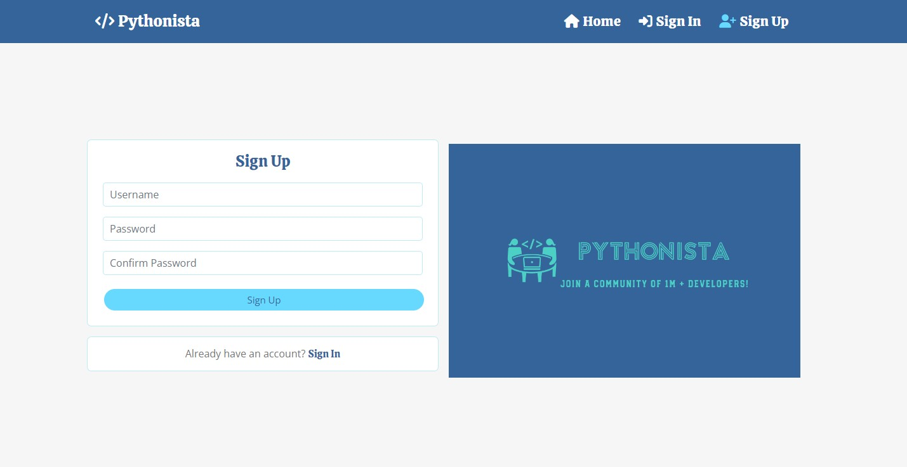

    The sign up page is only accessible if the user is logged out. This page consists of a form to be completed in order to sign up and create an account, and a link to the sign in page if the user already has an account.

* **SignIn Page**

    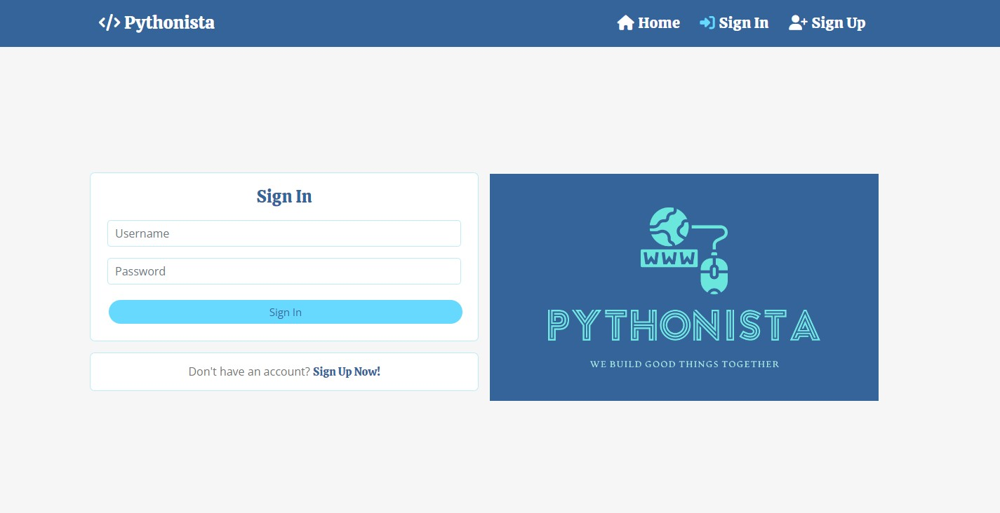

    The sign in page is only accessible if the user is logged out. This page consists of a form to be completed in order to sign in, and a link to the sign up page if the user does not yet have an account.

### _Future Implementations_

If there was time after my gratuation I'd like to implement these feature in Pythonista appp and make it more powerfull.

* **Job Page:**
Enable users to post a Job or apply a Job. I was planning to implement Job feature in PP5, but unfortunately due to some unexpected event with my asylum process I was force to leave the country and it happened just when I was about to work on my project. So I was not able to implement the Job feature.

here is the mock-up for Job feature:

* **Job Page**
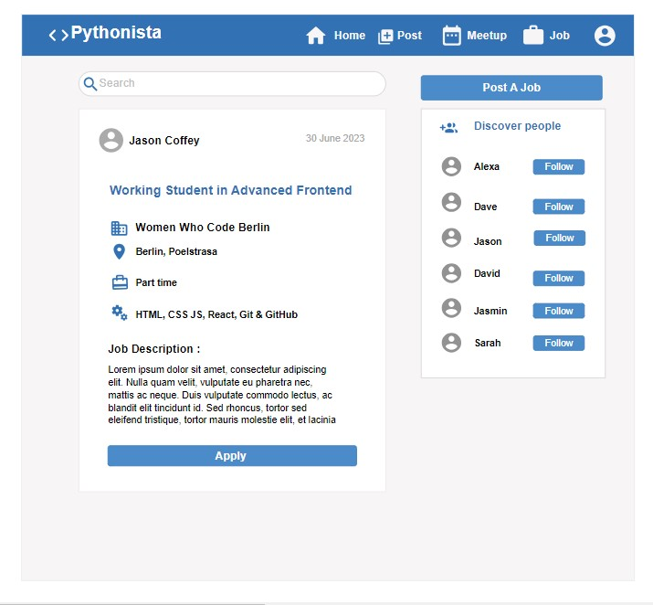

* **Applying For a Job Page**
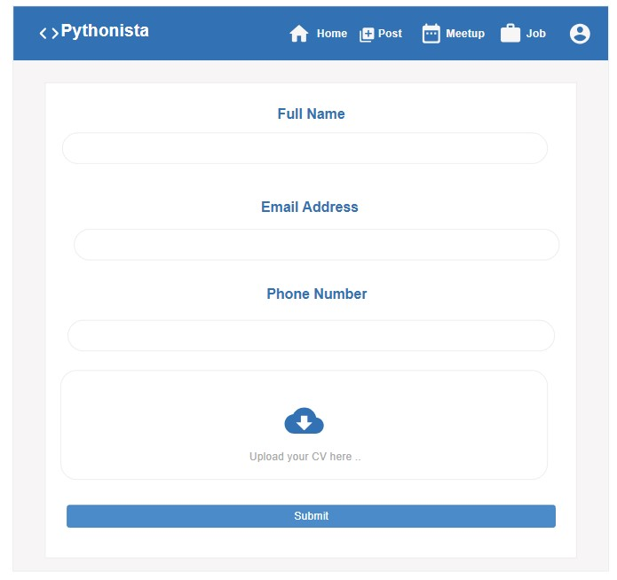

* **Create Job Post Page**
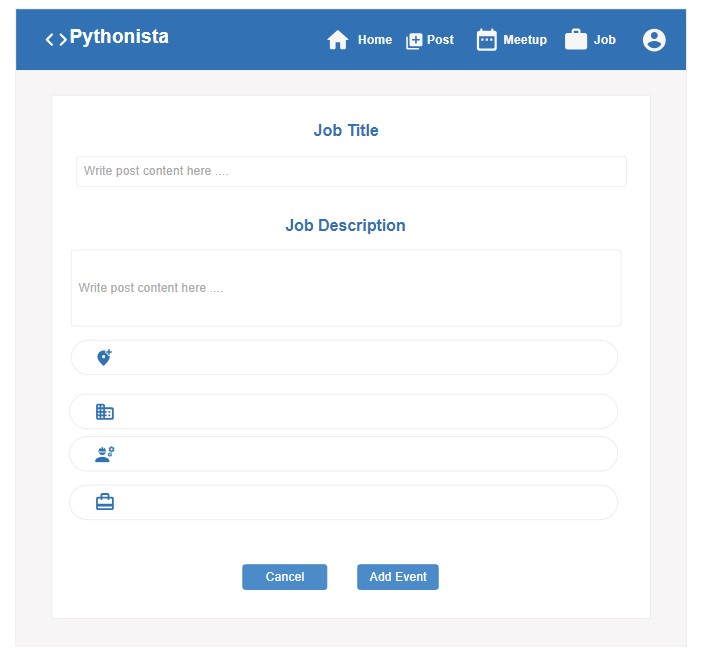

* **Notification Syatem:**
Allow users to recive notification when someone leave a comment on her/his post, event post or add reaction on a post.

* **Messaging System:**
A chat functionality, allowing users to send each other messages, and thus to create stronger connections between like-minded people.
Seeing which users are online including links to the chat page, enabling users to have real-time conversations.

## Design

### _Mock-Up_

* **Home Page**
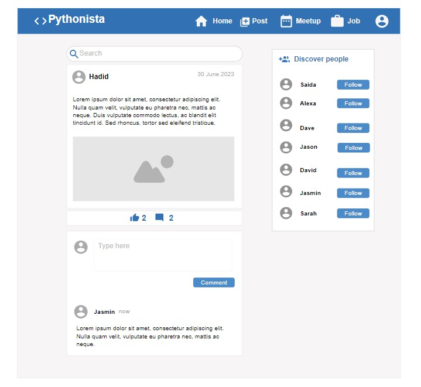

* **Create Post Page**
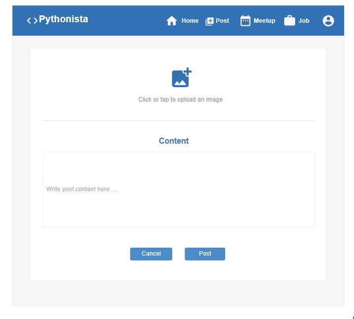

* **Create Post Page**
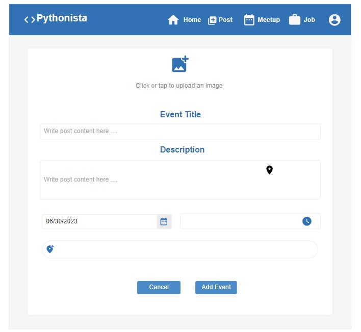

* **Event Page**
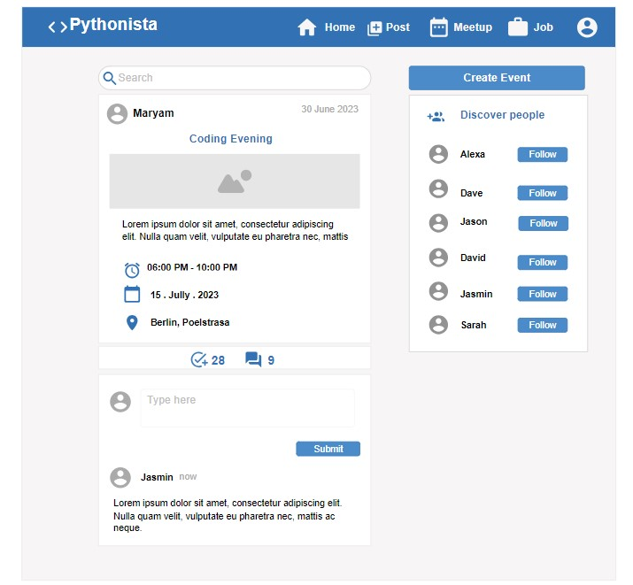

* **Profile Page**
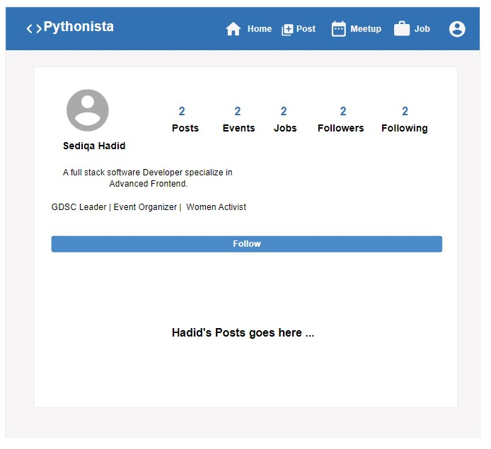

* **Job Page**

* **Applying For a Job Page**

* **Create Job Post Page**

### _Color_

The colour palette is made up of following colours:
 * #2d649b - NavBar background , buttons
 * #54D9FF - Button hover, border color
 * #C1DFFF - Inout hover
 * #F6F6F6 - Sit background
 * Black #000000 - Content
 * White #FFFFFF - Component background

### _Typography_
I used two google fonts for pythonista:
 * **'Open Sans', sans-serif** - Sit content
 * **'Calistoga', cursive** - NavBar Links

## Test

### _Code Validation_
The Pythonista site has been passed through the W3C CSS Validator .

* **W3C CSS Validation Results:**
 No errors or warnings were found when the code was passed through the W3C CSS Validation checker.
  
  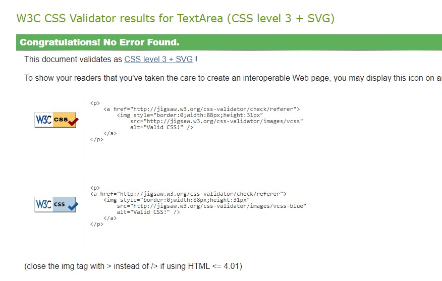

### _Automatic Testing_
The Jest automatic tests have been written to check that the main frontend components render correctly.

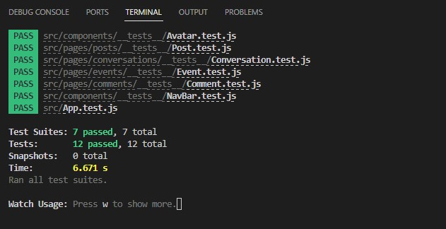

### _Manual Testing_

As well as the automatic tests, I carried out the following additional manual tests to check all the user story scenarios:

 * **Authentication - User Logged Out**
    1. The user can not access the following urls page, User is redirected Home:
        * Create Post Page
        * Edit Post Page
        * Create Event Page
        * Edit Event Page
        * Edit Profiles page

    2. Sign In/ Sign Up Page
        * Desktop users can see an image next to the SignIn/ SignUp form.
        * Mobile and Tablet users can't see an image next to the SignIn/ SignUp 
        form.

    3. Navigation Bar: Logged Out users can not access to the following links:

        * Profile
         * Sign Out
    

* **Post Component - LoggedIn**

    * Users can Create Post
    * Users can upload image
    * Users can change uploaded image
    * Users can like a Post
    * Users can leave a comment
    * Users of can edit/delete their own Posts

* **Event Component - LoggedIn**

    * Users can Create Event
    * Users can upload image
    * Users can change uploaded image
    * Users can mark Join an Event
    * Users can leave a conversation
    * Users of can edit/delete their own Events

* **Profiles - LoggedIn**

    * Users can view other users profile by clicking on their avatar
    * Users can Edit their Own profiles
    * Users can change their Username
    * Users can set a new password 
    

* **Following/Unfollowing - LoggedIn**

    * Users can follow another users
    * Users can unfollow another users

### _Responsiveness Testing_
The responsive design tests were carried out manually throughout the build using Google Chrome Dev Tools. I based the main design around a desktop view, as this is primarily a browser based platform, although I have added responsive design for tablet and mobile devices as well.
During the testing process I also used the Responsive Design Checker website to simulate the website on several other devices and All links, forms and pages working as expected.
Here are the results:

*  _Desktop View_
    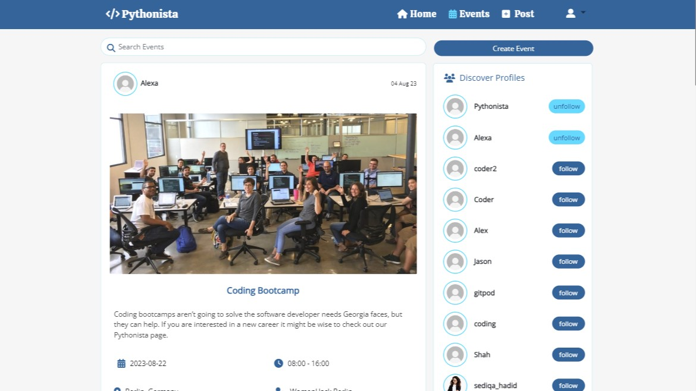

*  _Tablet View_
    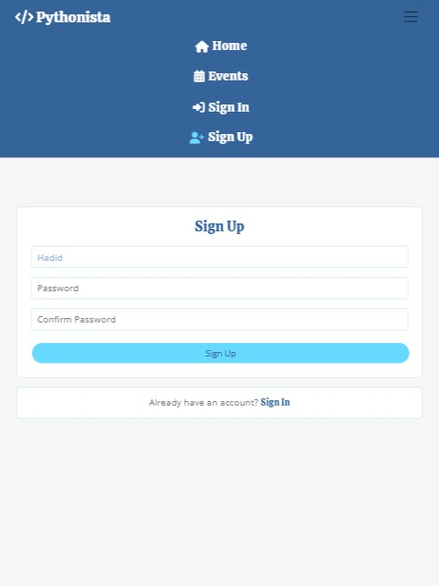

*  _Mobile View_

    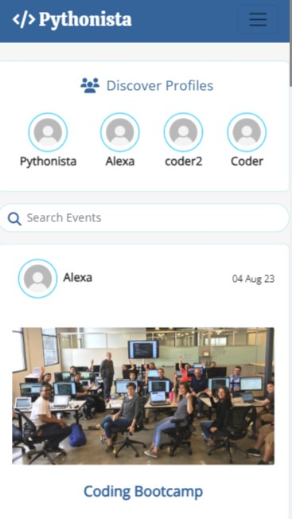

### _Lighthouse Testing_
Google Lighthouse in Chrome Developer Tools was used to test the application within the areas of Performance, Accessibility, Best Practices and SEO.

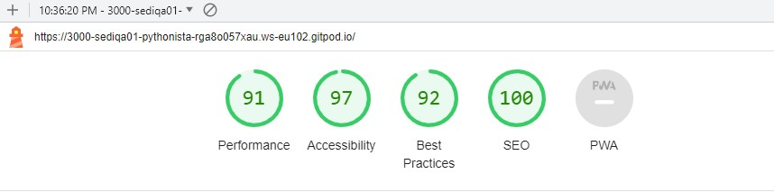

## Bugs

### _Solved Bugs_

1. During the development of the project, the connection between front-end and backend was disconnected;  And the reason was that the Gitpod URL was changed in the front-end.  With the help of Joanne, one of the tutor team, we connected both apps again.  The solution: By adding CLIENT_ORIGIN_DEV in the env.py file and also in the Heroku config var, the connection was re-established.

    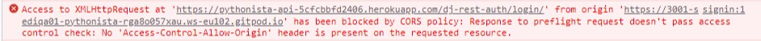

2. After installing tools on pythonista app, I've got different versions of some packages that caused, version error.
for solving this issue, I did the following steps:

    * Deleting your node_modules folder
    * Deleting your package-lock.json
    * Replacing the dependencies and scripts parts of package.json with CI moments walkthrough ptoject.

    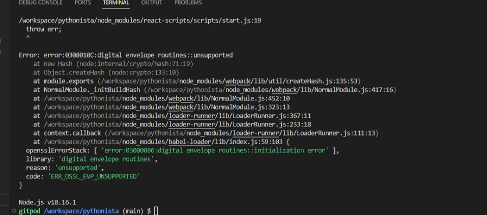

3.  When I was working on the readme file, the screenshots of the project were not displayed in github, but they were displayed well in the preview of gitpod. This problem was in the path of the files because I had written the path of the files (../pythonista/...), which is this path in Git. The post was correct, but it was wrong on GitHub.

Note: The challenges I encountered throughout development ranged from spelling mistakes to bootstrap style faults, API connection errors, and other component errors. I was able to find solutions by looking on Stackoverflow and other educational websites.

### _UnSolved Bugs_
No bugs so far.

## Technologies Used

### _Languages_

* **HTML5** - Provides the content and structure for the website.
* **CSS3** - Provides the styling for the website.
* **JavaScript** - Provides interactive elements of the website.
* **React.js** - Provides the base for the frontend components.

### _Frameworks, Libraries & Programs_

* **React -** React was used to create this web app.
* **React Bootstrap -** React Bootstrap was used to create this web app and to make it fully responsive.
* **Git -** Git was used for version control by utilizing the Gitpod terminal to commit to Git and Push to GitHub.
* **GitHub -** GitHub is used to store the projects code after being pushed from Git.
* **GitHub Projects -** GitHub Projects was used to create the User Stories.
* **Heroku -** Heroku was used for the deployed application.
* **Chrome DevTools -** Chrome DevTools was used to consistently check the site in terms of responsivity, performance, accessibility, best practice and SEO.
* **Cloudinary -** A service that hosts image files in the project.
* **My Free Logo Maker -** Used to create the Happening brand logo.
* **Moqups -** Used  to create the mock-ups during the design process, as well as Sign Up and Sign In hero images.
* **date-fns -** Installed to validate event date.
* **msw -** Mock Service Worker, Used for testing.

## Deployment

### _Heroku_

Once you have created a new gitpod workspace and set up the new project, you are ready to deploy to Heroku.

1. In your heroku account, select Create New App, and give it a unique name related to your project.
2. Select a region corresponding to where you live and click `Create App`.
3. Head into the `Deploy` tab select GitHub as the `deployment method`, find your project repository and click `Connect`.
4. Click `Deploy branch` to trigger Heroku to start building the application.
5. Once you see the message saying 'build succeeded' you can click `Open App` to see your application in the browser.

## Credits

1. The **Code Institute moments** walkthrough project both backend and frontend was a big guide.
2. The Upload image on the create event, and create postis taken from pngtree.com
3. With the help of my mentor **Adegbenga Adeye**, I added the event_date validation using date-fns.
4. The image for not found page was taken from **Iconduck** site.
5. In order to find a solution to a problem, I often search on the Stackoverflow.
6. The code for create event button as link was taken from **Where Is The Mouse**, Alexa Hendry helped me to sort it out.
    component dir > CreateEventForm.js file
7. The Sign In / Sign yp pic created in **My Free Logo Maker** by Sediqa Talbi

Note: It's good to document here, I got app error at the very last min when I was cloning my frontend app with backend app, before everything was working as it should. you can find the screenshot of diffrent part of app in React README.md file in pythonista repository.
I did automatic testing for both front app and backend app, It proves that app was wroking before cloning apps.

Beside I did my very best to build a good project for pp5, as refugee I didn't have normal life like others, going from one cuntry to another. I did all the whole course in the way of finding a place to live, maybe I could do better than today's output, but the situation is beyond my contorl. I proud of myself to make it done as much as I could.
**Thanks to everyone from CI who helped, listened, supported and understand me!**

